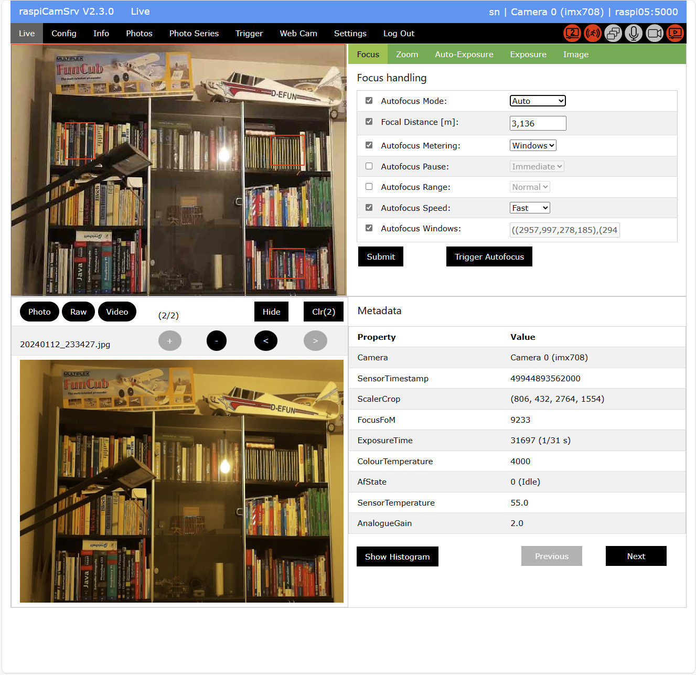

# raspiCamSrv

The Raspberry Pi Camera Server (raspiCamSrv) is a web server which can be deployed on a Raspberry Pi device giving access to installed cameras and allows to control these.

It can be installed on all Raspberry Pi platforms which allow connection of one or multiple cameras and supports the currently existing camera types.
Up to now, it was tested on Pi Zero W, Pi Zero 2 W, Pi 4 and Pi 5 running Bullseye as well as Bookworm together with camera modules 1, 2 and 3. On Pi 5, also parallel installation of two different cameras was tested.

raspiCamSrv is built with Flask 3.0 and uses the Picamera2 library.

Due to responsive layout from W3.CSS, clients can be all modern browsers as well as mobile devices.

## Feature Overview
For more details, see the [User Guide](docs/UserGuide.md)

- The **Live** tab shows a live stream of the active camera and allows individually selecting and setting all camera controls supported by Picamera2.
- For cameras with focus control (camera 3), it is also possible to graphically draw autofocus windows and trigger the autofocus to measure the LensPosition which is translated into a focal distance.
- Photos, raw photos and videos can be taken, which are shown in the lower part of the **Live** tab together with their metadata.
- For raw photos and videos, a jpeg placeholder is shown
- The photos taken may be added to a small buffer which can be navigated for comparison
- On the **Config** tab, camera configurations can be specified for four different use cases (Live View, Photo, Raw Photo and Video). These will be applied together with the selected controls when photos or videos will be taken.
- The **Info** screen shows the installed cameras, and, for the active camera, the camera properties as well as the available sensor modes.
- The **Photos** tab allows scrolling through all available photos and videos with detail views of selected items.
- The settings tab allows a few configuration settings such as selection of the active camera as well as selecting the type of photos, raw photos and videos in the range supported by Picamera2
- Access to the server requires registration and authentification.

## Limitations
The software is still being tested and extended.

- Timelapse features are envisaged.  It was actually the starting point for this project to develop a Pi Zero + Camera solution, based on actual software and hardware, which can be used for long runnting time lapse series.
- The entire configuration is still transient and will be reinitialized with server restart. It is intended to save the configuration in the database and restore it when the server is restarted.
- Although the layout is responsive, it may not be "good-looking" with all sizes of browser windows

## Credits
- Most technical information on Picamera2 (<https://github.com/raspberrypi/picamera2>) has been taken from the [Raspberry Pi - The Picamera2 Library](https://datasheets.raspberrypi.com/camera/picamera2-manual.pdf) document.
- The implementation of live streaming with Flask has been inspired by <https://blog.miguelgrinberg.com/post/video-streaming-with-flask>
- The detailed solution for the mjpeg_server is based on the example [mjpeg_server.py](https://github.com/raspberrypi/picamera2/blob/main/examples/mjpeg_server.py) of the [picamera2 repository](https://github.com/raspberrypi/picamera2)
- The solution for drawing on the canvas for definition of AF Windows has been inspired by <https://codepen.io/AllenT871/pen/GVyXKp>

## Setup / Getting Started

### Required
- A Raspberry Pi ([Zero W](https://www.raspberrypi.com/products/raspberry-pi-zero-w/), [Zero 2 W](https://www.raspberrypi.com/products/raspberry-pi-zero-2-w/), [Pi 1](https://www.raspberrypi.com/products/raspberry-pi-1-model-b-plus/), [Pi 3](https://www.raspberrypi.com/products/raspberry-pi-3-model-b-plus/), [Pi 4](https://www.raspberrypi.com/products/raspberry-pi-4-model-b/), [Pi 5](https://www.raspberrypi.com/products/raspberry-pi-5/))
- A [Raspberry Pi camera](https://www.raspberrypi.com/documentation/accessories/camera.html)
- A suitable camera cable (Pi Zero and Pi 5 have the small CSI-2 camera port, requiring a special cable)
- A microSD card
- A suitable power supply
- A Wifi network with internet access and known access credentials (SSID, password)
- A PC with network access and SD card reader

### System Setup
For system setup, follow the instructions of the [Raspberry Pi Getting Started Documentation](https://www.raspberrypi.com/documentation/computers/getting-started.html)

### 

|Step|Action
|----|--------------------------------------------------
|1.  | 