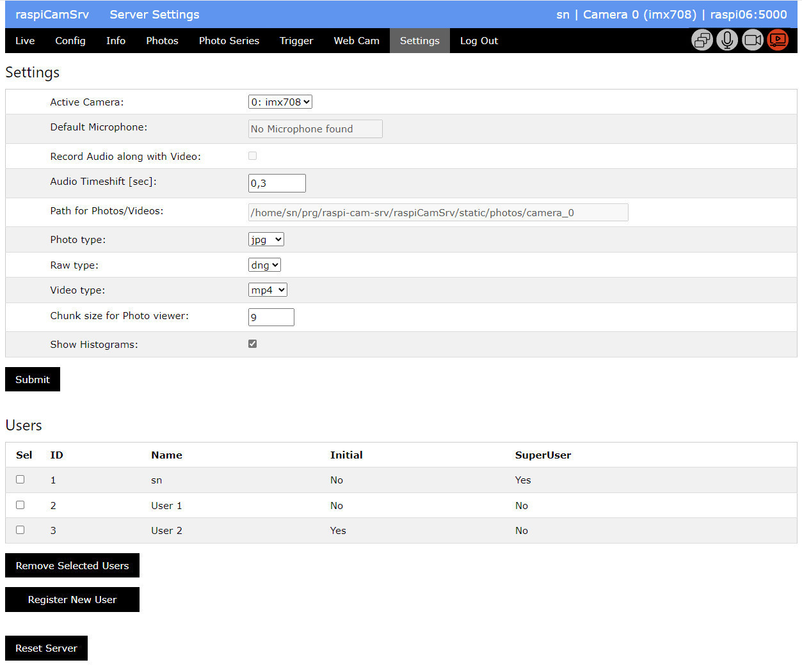
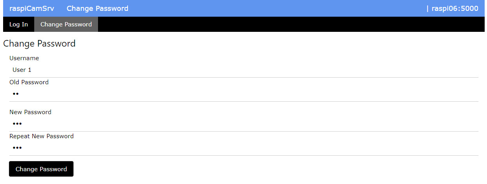
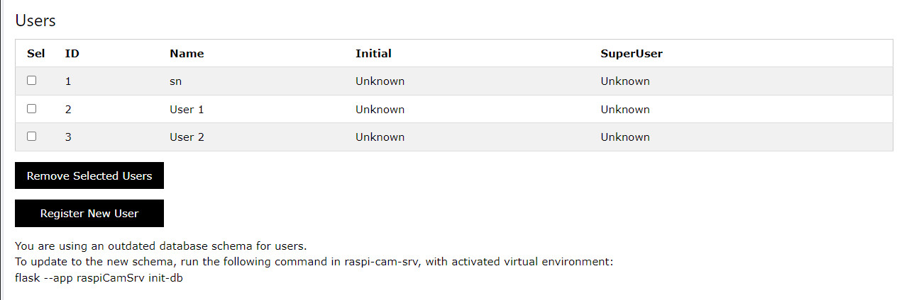

# raspiCamSrv Authorization

[](./UserGuide.md)

Access to the raspiCamSrv server requires login with Username and Password.   
A user session will live as long as the browser remains open, even if the tab with a **raspiCamSrv** dialog has been closed.

The basic principle is that the first user in the system will be automatically registered as SuperUser.
Only the SuperUser will be able to register new users or remove users from the system.

After the database has been initialized with ```flask --app raspiCamSrv init-db``` (see [RaspiCamSrv Installation](../README.md#raspicamsrv-installation) Step 10), there is no user in tha database.

In this situation, any connect to the server will open the *Register* screen:   


Now, the SuperUser can complete his registration and will then be redirected to the *Log In* screen:   
   
From now on, the *Register* screen will no longer be available through the menu.   
Also, direct access through the *Register* screen URL will only be allowed for the SuperUser. Other users will be redirected to the *Live* screen.

## User Management

For management of users, the *Settings* screen has an additional section *Users* which is visible only for the SuperUser:   
   

The list shows all registered users with
- unique user ID
- user name
- Initial, indicating whether the user has been initially created by the SuperUser and needs to change password on first log-in.
- SuperUser, indicating the user registered as SuperUser

The SuperUser can
- register new users using the *Register New User* button
- remove users which have been selected in the list

## Password

Users with flag "Initial" will automatically be requested to change their password when they log in for the first time.   
All users can change their password before they are logged in.

    
After the password has been successfully changed, the *Log In* screen will be opened.

## Old User Schema

The functionality described above is available for systems installed after Feb. 15, 2024.   
Systems installed before but updated (git pull) later, still work with the old user schema.

In this case, all users are considered SuperUsers.

The [User Management](#user-management) functionality in the *Settings* screen will be available for all users.   
However, a hint is shown to update the database schema:

