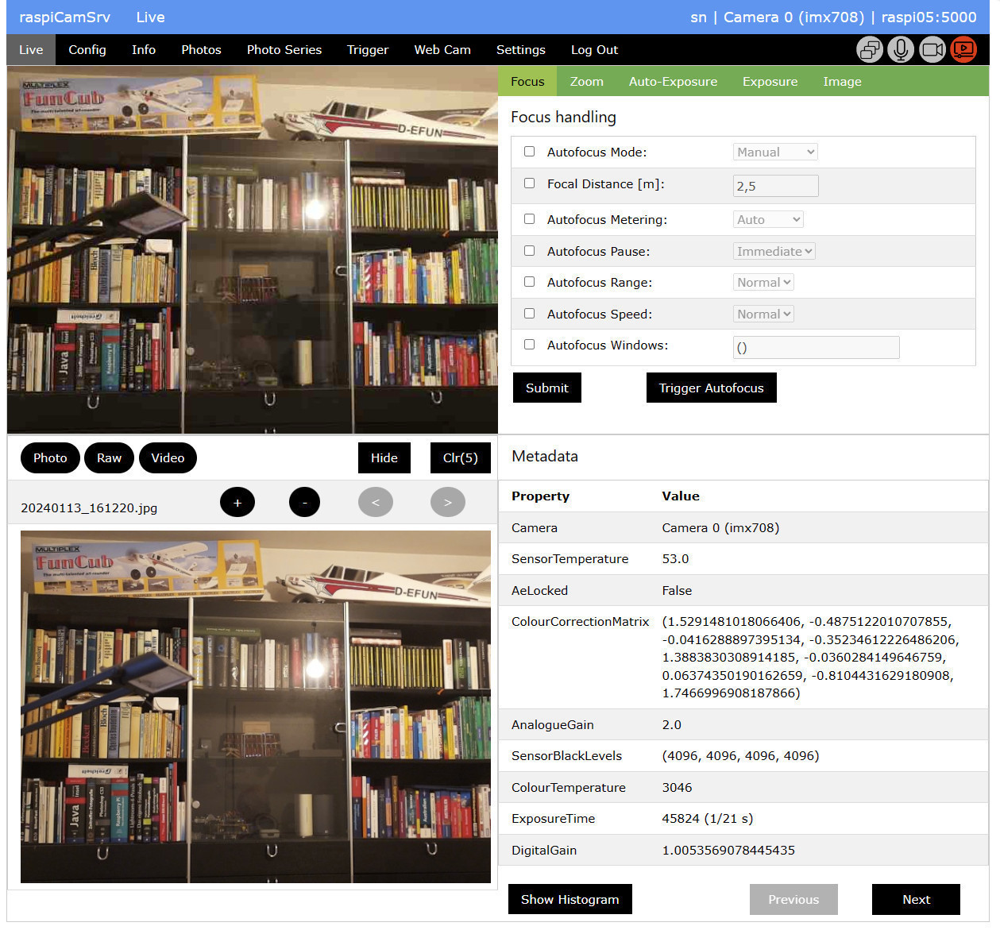

# raspiCamSrv Live Screen

[](./UserGuide.md)

The **Live** screen is the central part of the application.   
After photos or videos have been taken in the current session, its layout is as shown below:

## Layout

### Top Left Quarter
This is the area where a Live stream is shown, except for phases when videos are recorded.

### Top Right Quarter
This area allows selecting and configuration of all [Camera Controls](./CameraControls.md). These are parameters which affect the characteristics of images and outputs of the camera and which can be modified while the camera is running.   
The menu row of this section groups the controls into several categories.

### Bottom Left Quarter
The bottom part of the screen is only shown if a Photo or video has been taken within the server's life time and if the user did not decide to hide this area.

The bottom left quarter presents function buttons for [Photo/Video taking](./Phototaking.md)   
In addition, there are also buttons controlling the photo buffer to which users can add or remove individual photos and navigate between them.

Raw photos or videos are not shown directly. Instead a placeholder in the configured photo format is shown.

### Bottom Right Quarter
Here, the metadata of the currently visible photo/video are shown.
The metadata are captured within the same **Capturing Request** together with the photo itself.   
In the case of videos, the metadata are captured immediately before recording starts.
