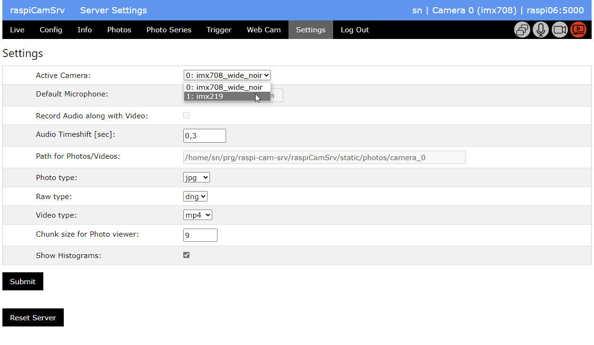

# raspiCamSrv Settings

[](./UserGuide.md)

This screen allows for some basic configurations, such as selecting the standard file types for photos, raw photos and videos.


## Switching the active Camera

On systems which allow connection of multiple cameras (e.g. Pi 5), it is possible to switch the active camera.   
Only non-USB cameras are offered for selection (see also [Information](./Information.md#cameras))



## Activating / Deactivating Histograms

**raspiCamSrv** can show histograms for photos.   
Histograms are generated with [OpenCV](https://de.wikipedia.org/wiki/OpenCV).  
This requires that the packages OpenCV, numpy and matplotlib are installed (see [RaspiCamSrv Installation](../README.md#raspicamsrv-installation) Step 9)   


If these packages are installed, you can select whether or not to *Show Histograms*.   
The default on first server start is to show histograms.

It may be necessary on smaller systems (Raspberry Pi Zero W, Raspberry Pi Zero 2 W) to deactivate this option because of memory restrictions.   
If the option is deactivated, the modules are not loaded and histograms will not be displayed, even if all packages are installed.

The system will automatically detect whether or not the required packages are installed and accessible. If this is not the case, this will be indicated:


## Recording Audio along with Video

### Preconditions

If a microphone, such as a USB microphone is connected to the Raspberry Pi, it is possible to record audio along with videos.

Picamera2 accesses the microphone through [PulseAudio](https://wiki.archlinux.org/title/PulseAudio).
PulseAudio daemons (```pulseaudio.socket``` and ```pulseaudio.service```) are running as [user units](https://wiki.archlinux.org/title/Systemd/User) and not as system units.

In order to access the microphone, **raspiCamSrv** needs to run in the user environment, too.   
This is automatically the case when the Flask service is directly started from the command line in the **raspiCamSrv** virtual environment with   
```flask --app raspiCamSrv run --debug --host=0.0.0.0```

Alternatively, **raspiCamSrv** can be configured as **user** service as described in [README](../README.md#service-configuration-for-audio-support)

### Configuration

**raspiCamSrv** will automatically detect whether a microphone is connected and accessible through PulseAudio.

If this is the case, the default microphone will be shown in the Settings screen:
    
Also the checkbox *Record Audio along with Video* is enabled for change.

If the checkbox is checked, audio will be recorded when a video will be recorded.

If no microphone is connected or the microphone is not accessible through PulseAudio (because **raspiCamSrv** runs as system service), this will be indicated as   
    
and the *Record Audio along with Video* checkbox is disabled.

Microphones can be plugged in/out without stopping the system. After a refresh of the *Settings* screen, the system will detect the changed setup.

If multiple microphones are plugged in, PulseAudio will automatically select a default microphone.   
If the selected microphone is not the intended one, plug it out temporarily. Pulse Audio will automatically select another default and keep it.


### Audio/Video Synchronization

Due to timing issues of audio and video subsystems, there may be a delay between video and audio.   
The discrepancy is typically in subsecond range.

Test videos should be made with something like a clapperboard. In case of delays, the *Audio Timeshift* value should be adjusted (it can be positive or negative) until video and audio are in sync.

