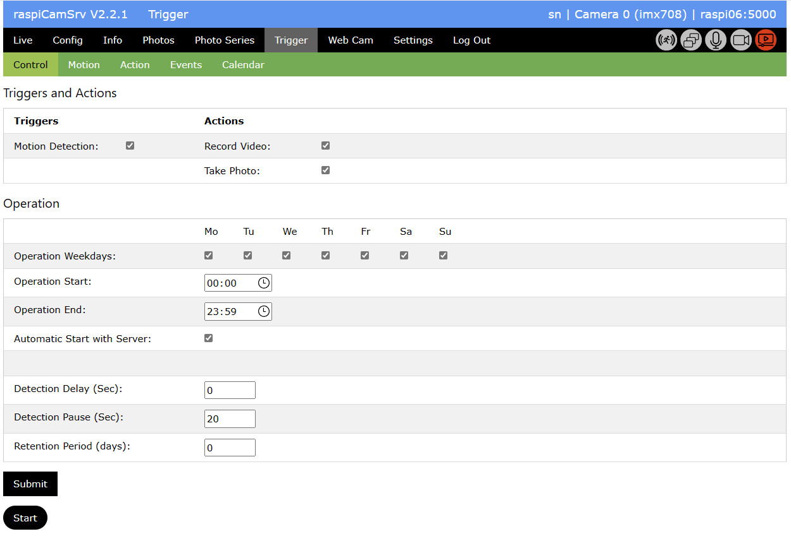
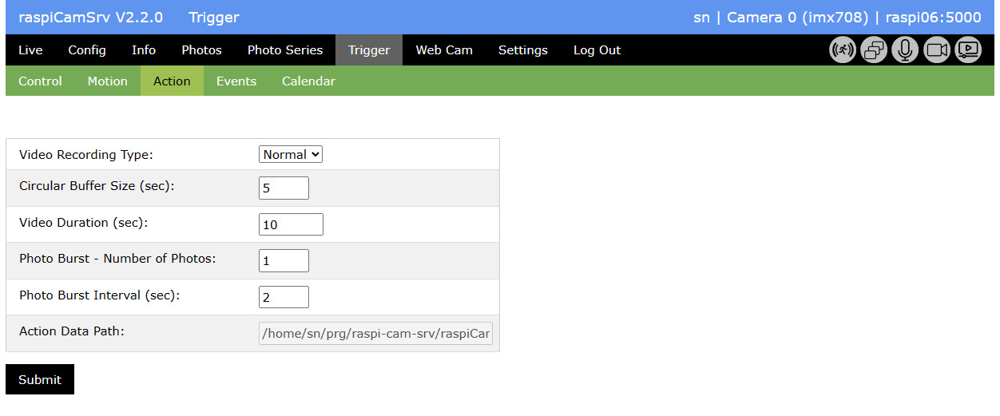

# Triggered Capture of Videos and Photos

[](./UserGuide.md)

**raspiCamSrv** supports triggered capture of videos and photos.

Currently, only motion is supported as trigger.

Motion detection is basic and based on frame-differencing with simple mean square difference analysis and a configurable threshold.

Further reading:
- [Active Motion Capture](./TriggerActive.md)
- [Event Viewer](./TriggerEventViewer.md)

## Control



In the *Control* section, you may specify basic aspects of triggered capture:

- Under *Triggers*, you select the triggers to be used.   
Currently, only motion detection is available.
- Under *Actions* you specify the actions to be taken in case of a trigger event.   
You may select among video recording and photo taking.   
In case *Record Video* is selected, also at least one photo must be taken. This photo will serve as placeholder for the video in the [Event Viewer](./TriggerEventViewer.md).
- With *Operation Weekdays*, you specify the weekdays when triggering shall be active.
- *Operation Start* specifies the daytime when triggering is activated on each active weekday.
- *Operation End* specifies the daytime when triggering is paused.
- *Automatic Start with Server*   
When activated, the trigger capturing process can be automatically started with the server.   
When you change this parameter, you need to go to [Settings](./Settings.md) and store the current [Server Configuration](./Settings.md#server-configuration)   
If you want automatic start, you also need to select *Start Server with stored Configuration*.    
**Note** In case you start the Flask server manually, do not use the ```--debug``` option. This will cause an exception (see [Flask Issue #5437](https://github.com/pallets/flask/discussions/5437)).
- *Detection Delay* allows specifying a dalay in seconds. When an event is triggered, the configured action (video and/or photo) will be delayed by the specified number of seconds. Normally, this will be 0.
- *Detection Pause* specifies a 'dead time' after an event has been registerd. Within this time no new event will be registered although the system will not stop detecting motion.   
This setting prevents from being flooded with registered events, for example if motion persists for a longer time.
- *Retention Period* specifies the number of days  for which event data will be retained when a [cleanup](./TriggerEventViewer.md#cleanup) is done.

Data changes will not be persisted unless the **Submit** button has been pressed.

For activation of motion capturing, see [Active Motion Capturing](./TriggerActive.md) 

## Motion Configuration


This section allows specification of motion capturing aspects:

- *Motion Detection Algorithm* allows selecting the algorithm by which the system will recognize motion through its camera.   
Currently, *Mean Square Difference* is supported as frame-differencing algorithm.
- *Mean Square Threshold* is the value of the mean square difference above which the system detects a motion event.

## Actions



This section allows specification of aspects for photos and/or videos recorded in reaction an an  event:

- *Video Recording Type*   
With *Normal*, video recording starts with the event or, if configured, after a specified dalay.   
With "Circular*, the system continuesly captures video in a circular buffer with a capacity of a few seconds. In case of an event, also the seconds before the event will be available in the video.   
Currently, only *Normal* is supported.
- *Circular Buffer Size* is the number of seconds, the system shall look 'backwards' from the time of an event.
- *Video Duration* specifies the length of videos captured in case of an event.    
If a new event is registered while video recording from the previous event is still active, this will be stopped before recording for the new event starts.
- *Photo Burst - Number of Photos* allows specifying a number of photos which will be successively captured in case of an event.   
If video is recorded, at least one photo must be specified.
- *Photo Burst Interval* is the interval after the previous photo when the system will capture a new photo if there is still motion detected. If no motion is detected after this interval, no photo will be taken.
- *Action data path* is the path where pictures an logs for events will be stored.