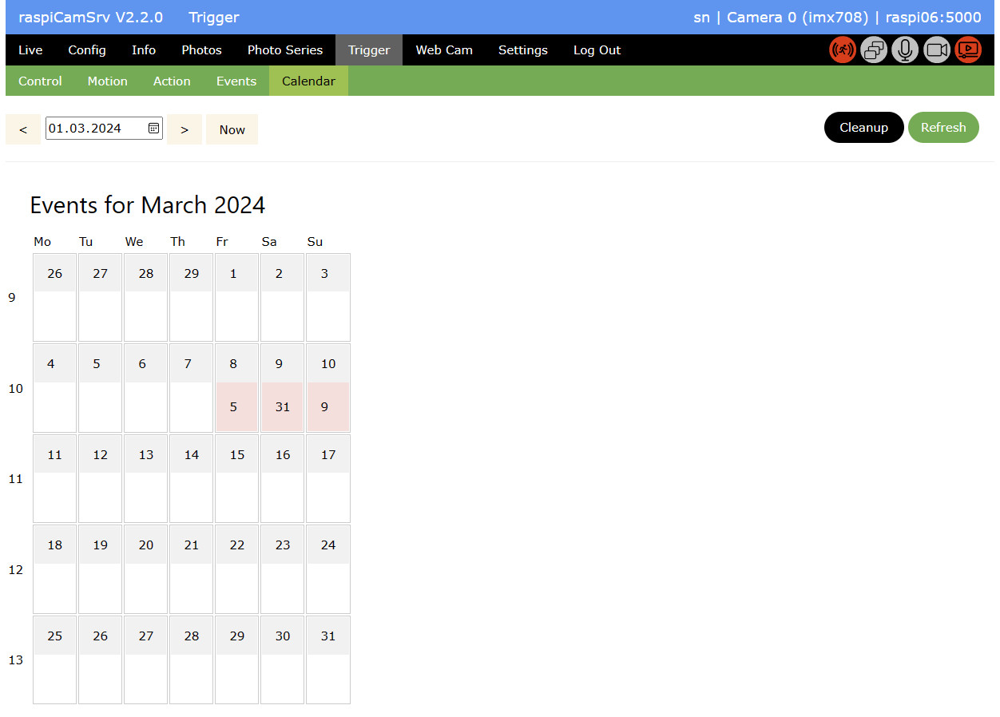
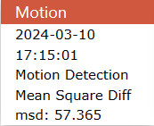
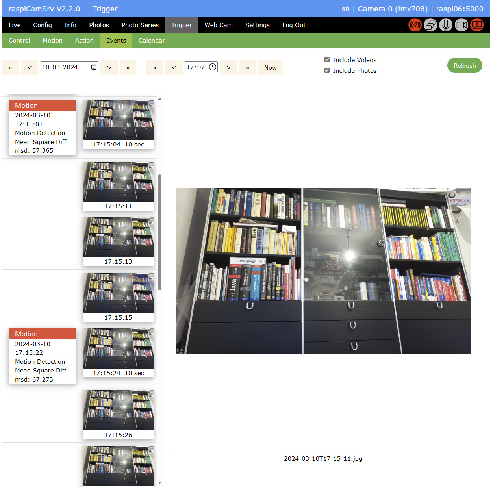

# Triggered Capture of Videos and Photos

## Calendar

The calendar gives an overview on the number of events which have been registered for a specific day:

Clicking on a red field navigates to the [Events](#events) display for this specific day.

You can change the active month using the date control and navigation arrows, or return to the current month with the *Now* button.

### Cleanup

The *Cleanup* button can be used for event cleanup after a confirmation

The *Retention Period* for cleanup has been specified on the [Trigger/Control](./Trigger.md) page.

For all events older than the *Retention Period*, cleanup will

- remove all log file entries
- delete all photo and video files
- delete related database entries

# Events

Event Details are shown in the Event Viewer for a specific day:

In the top area, you may 
- change the active day using the date control or the arrow buttons.   
Single arrows shift by day, double arrows by week.   
In each case the starting hour is set to 00:00h.
- change the start time from which on events will be shown.   
Here, single arrows shift by a quarter of an hour, double arrows by an hour.
- You can select whether you want to see videos, photos, both or none.   
In case of videos, the first photo is always shown instead of the video on the left side, however clicking on the photo will open the video viewer.
- whether a video or a photo is represented by the small picture can be distinguished by information on the video length.

Selecting a video or photo shows it in the detail area on the right side.

The Event Card for each event     
    
shows, from top to bottom:
- Event Type (currently always "Motion")
- Event date
- Event time
- Event trigger (Currently only "Motion Detection")
- Event trigger algorithm
- Trigger parameter   
"msd" is the mean square deviation between successive frames.   
you may use the information to fine tune the *Threshold* value on the [Motion](./Trigger.md#motion-configuration) tab.

In case that photos have been taken together with videos, this is represented as shown below.   
Videos show the video length in the footer.

