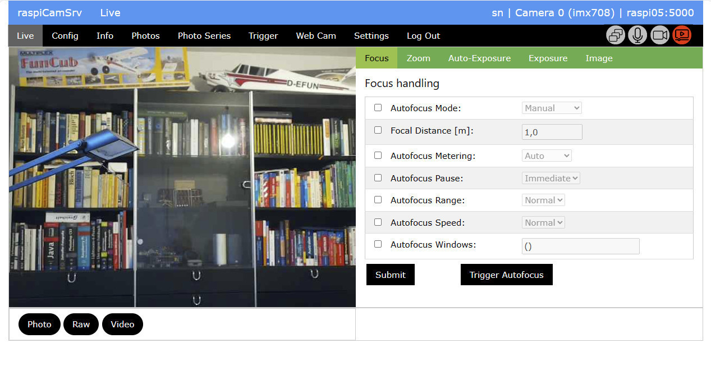

# RaspiCamSrv User Guide

**NOTE**     
For a full understanding of application details, users should familiarize with the official document [Raspberry Pi - The Picamera2 Library](https://datasheets.raspberrypi.com/camera/picamera2-manual.pdf).  
The document version, on which this raspiCamSrv release is based, is also included in this documentation: [picamera2-manual.pdf](./picamera2-manual.pdf)

When the server on a Pi is running and the Pi is reacheable through the network (usually WiFi), you can connect with a browser using the Pi address ('raspi05' in the example below) with the Flask port number, usually 5000, e.g.:  
```http://raspi05:5000```

The system will request an initial [registration and a login](./Authentication.md) and subsequently open the **Live** application screen.

## Application Screen


### Elements

#### Title bar
On the right side, the title bar shows
- the current server connection
- the active camera as advertised by Picamera2
- the active user

On the left side, the title bar shows the application name (raspiCamSrv) and the current screen.

#### Main Menu
The main menu (black background) allows navigation to different screens
- **Live** shows the [Live Screen](./LiveScreen.md) which includes functionality for image control as well as photo- and video taking
- **Config** gives access to camera [Configuration](./Configuration.md) where basic camera configurations can be specified for different scenarios.
- **Info** opens the [Camera Information](./Information.md) page with information on installed cameras as well as Properties and Sensor Modes of the active camera.
- **Photos** shows the [Photos](./PhotoViewer.md) where the currently available photos and videos can be browsed and inspected in detail.
- **Timelapse** opens the [Timelapes](./Timelapse.md) page for control of timelapse series.
- **Settings** opens the [Settings](./Settings.md) page where some basic server parameters can be configured and where the active camera can be switched in case the Raspberry Pi device supprts multiple cameras (such as Pi 5).

#### Message Line
At the bottom of the screen, there is a message line where application messages will be shown when necessary.